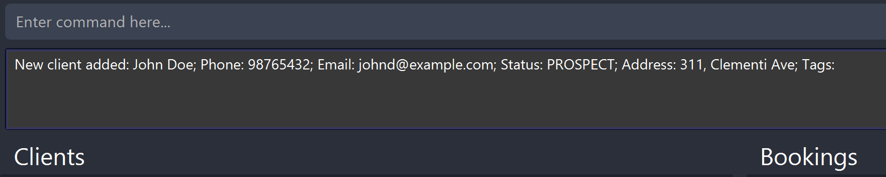
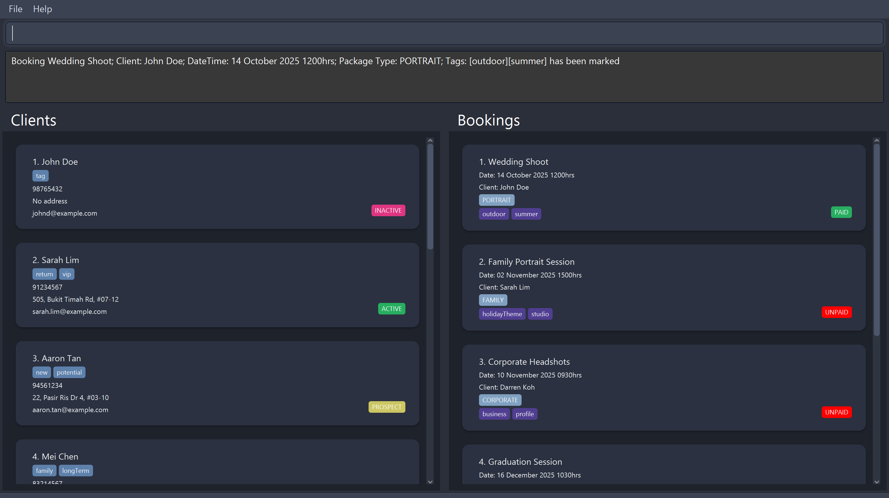
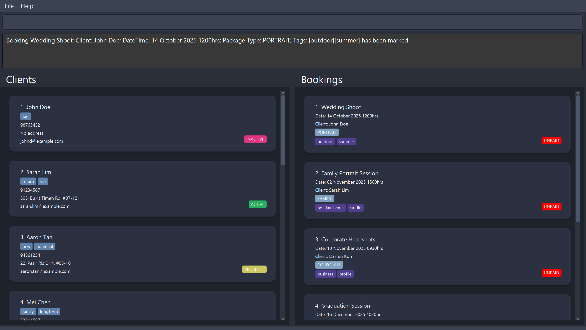
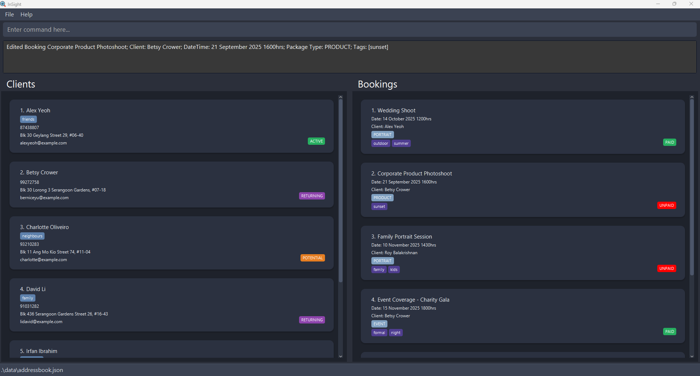

# InSight User Guide

> **Version:** 1.6  
> **Built for:** Creative professionals (photographers, videographers, and media freelancers)  
> **Based on:** SE-EDU AddressBook Level 3

---
# 📚 Introduction

Welcome to **InSight**, a smart and intuitive tool designed to help you manage your **clients** and **bookings**, and **service packages** all in one place. Whether you’re tracking client details, scheduling appointments, or organizing your services, **InSight simplifies day-to-day management** and keeps everything organized.

**If you are:**
- A solo photographer or videographer handling end-to-end client work
- Part of a small studio or freelance team juggling schedules and packages
- Familiar with Command-Line Interface (CLI) based applications
- Looking for a simple, creative-friendly client management system

**InSight is made for you**.

This user guide will walk you through the **key features** of the application, provide **step-by-step instructions** for common tasks, and give helpful **tips** to make your workflow more efficient. By the end, you’ll know how to:

- **Add and manage clients**
- **Create and update bookings**
- **Make the most of InSight’s powerful tools**


> **Who this is for:** Solo creators, small studios, and boutique teams in the **photography/videography market**
> looking for speed, clarity, and control—without paying with time or sanity.


## 📖 Table of Contents

1. [Quick Start](#-quick-start)
2. [Command Reference](#-command-reference)
3. [Features](#-features)
    - [Adding a Client: `add`](#adding-a-client-add)
    - [Adding a Booking: `addbooking`](#adding-a-booking-addbooking)
    - [Listing all Clients: `list`](#listing-all-clients-list)
    - [Listing all Bookings: `listbooking`](#listing-all-bookings-listbooking)
    - [Marking a Booking as Paid: `markbooking`](#marking-a-booking-as-paid-markbooking)
    - [Marking a Booking as Unpaid: `unmarkbooking`](#marking-a-booking-as-unpaid-unmarkbooking)
    - [Editing a Client: `edit`](#editing-a-client-edit)
    - [Editing a Booking: `editbooking`](#editing-a-booking-editbooking)
    - [Deleting a Client: `delete`](#deleting-a-client-delete)
    - [Deleting a Booking: `deletebooking`](#deleting-a-booking-deletebooking)
    - [Finding Clients: `find`](#finding-clients-find)
    - [View all a Client’s Bookings: `viewbooking`](#view-all-a-clients-bookings-viewbooking)
    - [Sorting Clients: `sort`](#sorting-clients-sort)
    - [Sorting Bookings: `sortbooking`](#sorting-bookings-sortbooking)
    - [Clearing All Data: `clear`](#clearing-all-data-clear)
    - [Help: `help`](#viewing-help-help)
    - [Exit: `exit`](#exiting-the-program-exit)
4. [Glossary](#-glossary)
5. [Saving the Data](#-saving-the-data)
6. [Frequently asked questions](#-frequently-asked-questions-faq)

---

## ⚡ Quick Start
Follow this guide to start your journey with InSight.
1. Ensure **Java 17** or above is installed on your computer. Download it [here](https://www.oracle.com/java/technologies/javase/jdk17-archive-downloads.html).<br>
Unsure of your java version? Open your terminal and run:
   ```bash
   java -version
   ```
2. Download the latest `.jar` file from [InSight Releases](https://github.com/AY2526S1-CS2103T-T08-1/tp/releases).
3. Copy the file to your preferred folder. This will be the **home folder** for InSight.
4. Open your terminal, navigate to the InSight's home folder and run:
   ```bash
   java -jar insight.jar
   ```
   InSight will start up, and the application window will appear.
5. Once InSight loads, you should see the following:
   
**<sub><i>Image: InSight's Graphical User Interface (GUI) with sample data</i></sub>**

    Sample data will be included on the first start-up. Take a look around and try some of these commands to get yourself familiarised:
    1. Add a client: `add n/John Doe p/98765432 e/johnd@example.com s/PROSPECT a/311, Clementi Ave`
    2. Add a booking for the first client: `addbooking 1 d/Wedding Shoot dt/14/10/2026 1200 p/PORTRAIT t/outdoor t/summer`
    3. Find active clients: `find status active`
> 💡 **Tip:** The **status box** will show you the status of InSight after running the commands. For example, after adding the client in the first command, you should see this:
>  <sub><i>Image: Status box</i></sub><br>
> This wil be helpful for tracking the changes your command has made to InSight.

6. Use the command such as `help` to see the list of available commands
7. Once you are ready to start, run `clear` in the command box to clear the sample data and **begin your InSight journey**.


If you are unsure what each component of the Graphical User Interface (GUI) is for, refer to the image below!


**<sub><i>Image: InSight's Graphical User Interface (GUI) with labels</i></sub>**

---

## 💻 Command Reference

### Client Management Commands

| Command  | Description                                                                                                                                                                                     |
|----------|-------------------------------------------------------------------------------------------------------------------------------------------------------------------------------------------------|
| `add`    | Adds a client to InSight. <br/> Parameters: `n/NAME p/PHONE e/EMAIL s/STATUS [a/ADDRESS] [t/TAG]` <br/> Example: `add n/John Doe p/98765432 e/johnd@example.com s/PROSPECT a/311, Clementi Ave` |
| `delete` | Deletes a client. <br/> Parameters: `INDEX`  <br/> Example: `delete 1`                                                                                                                          |
| `edit`   | Edits client details. <br/> Parameters: `INDEX [n/NAME] [p/PHONE] [e/EMAIL] [s/STATUS] [a/ADDRESS] [t/TAG]` <br/> Example: `edit 1 p/91234567 e/johndoe@example.com`                            |
| `list`   | Lists all clients. <br/> Example: `list`                                                                                                                                                        |
| `find`   | Finds clients by name or status. <br/> Parameters: `name + [name1 name2…]` or `status + [status1 status2…].  <br/> Examples . `find name alice bob . `find status active returning`             |
| `sort`   | Sorts clients lexicographically.   <br/> Example: `sort`                                                                                                                                        |

### Booking Management Commands

| Command         | Description                                                                                                                                                                                          |
|-----------------|------------------------------------------------------------------------------------------------------------------------------------------------------------------------------------------------------|
| `addbooking`    | Adds a booking to InSight. <br/> Parameters: `INDEX d/DESCRIPTION dt/dd/mm/yyyy HHmm p/PACKAGE t/TAG` <br/> Example: `addbooking 1 d/Wedding Shoot dt/14/10/2025 1200 p/PORTRAIT t/outdoor t/summer` |
| `editbooking`   | Edits booking details. <br/> Parameters: `INDEX [d/DESCRIPTION] [dt/DATETIME] [p/PACKAGE] [t/TAG]`  <br/> Example: `editbooking 1 d/Wedding Shoot p/WEDDING`                                         |
| `deletebooking` | Deletes a booking. <br/> Parameters: `INDEX` <br/> Example: `deletebooking 1`                                                                                                                        |
| `listbooking`   | Lists all bookings <br/> Lists all bookings within InSight. <br/> Example: `listbooking`                                                                                                             |
| `viewbooking`   | Displays all bookings for a specific client.<br/> Parameters: `INDEX` <br/> Example: `viewbooking 1`                                                                                                 |
| `sortbooking`   | Sorts bookings by date and time.   <br/> Example: `sortbooking`                                                                                                                                      |
| `markbooking`   | Marks a booking as 'Paid'. <br/> Parameters: `INDEX` <br/> Example: `markbooking 1`                                                                                                                  |
| `unmarkbooking` | Marks a booking as 'Not Paid'. <br/> Parameters: `INDEX`   <br/> Example: `unmarkbooking 1`                                                                                                          |

### General Commands

| Command | Description                                          |
|---------|------------------------------------------------------|
| `clear` | Clears all data from InSight. <br/> Example: `clear` |
| `help`  | Displays help information. <br/> Example: `help`     |
| `exit`  | Exits InSight. <br/>  Example: `exit`                |

---

## 🧭 Features

- See the [Glossary](#-glossary) if a term is unfamiliar.
- Valid client **status** values are listed [here](#1-client-status).
- Read about **INDEX** behavior [here](#5-indexing).
- Date & time formatting is defined [here](#4-date--time-format).
- Suggested **package types** are listed [here](#2-package-types).
- Learn how to use **tags** for your own tracking [here](#3-tag).

### Adding a Client: add

Adds a Client to InSight.

**Format:**  
`add n/NAME p/PHONE e/EMAIL s/STATUS [a/ADDRESS] [t/TAG]…`

The status field (e.g., PROSPECT, ACTIVE, RETURNING) helps classify clients by engagement level.

> 💡 **Tips:**
> 1. A client can have 0 or 1 address.
> 2. A client can have any number of tags (including 0).

**Examples:**  
`add n/John Doe p/98765432 e/johnd@example.com s/PROSPECT a/311, Clementi Ave t/wedding`  
`add n/Betsy Crowe t/friend e/betsycrowe@example.com s/ACTIVE a/Newgate Prison p/1234567 t/portrait`


**<sub><i>Image: InSight successfully added a new Client</i></sub>**

### Adding a booking: addbooking

Adds a booking to a specific client in InSight.

**Format:**  
`addbooking INDEX d/DESCRIPTION dt/dd/mm/yyyy HHmm p/PACKAGE [t/TAG]…`

**Notes:**

- The INDEX refers to the client’s index in the displayed list.
- Each booking is tied to a client entry.
- Tags can represent the booking type, theme, or location.

**Examples:**  
`addbooking 1 d/Wedding Shoot dt/14/10/2025 1200 p/PORTRAIT t/outdoor t/summer`  
`addbooking 2 d/Product Photoshoot dt/10/09/2025 1600 p/CORPORATE t/studio`


**<sub><i>Image: InSight successfully added a new Booking</i></sub>**

### Listing all clients: list

Shows a list of all clients stored in InSight.

**Format:**  
`list`

**Example:**  
`list`

### Listing all bookings: listbooking

Displays all bookings stored in InSight.

**Format:**  
`listbooking`

**Example:**  
`listbooking`

### Marking a booking as paid: markbooking

Marks a booking as Paid.

**Format:**  
`markbooking INDEX`

**Notes:**  
The INDEX refers to the booking number displayed in the booking list. This helps users track completed or settled
payments.

**Example:**  
`markbooking 1`


**<sub><i>Image: InSight successfully marks a Booking as paid</i></sub>**


### Marking a booking as unpaid: unmarkbooking

Marks a booking as Unpaid.

**Format:**  
`unmarkbooking INDEX`

**Example:**  
`unmarkbooking 2`


**<sub><i>Image: InSight successfully unmarks a Booking </i></sub>**

### Editing a client: edit

Edits details of a client in InSight.

**Format:**  
`edit INDEX n/NAME p/PHONE e/EMAIL s/STATUS [a/ADDRESS] [t/TAG]…`

**Notes:**

- The INDEX refers to the client’s position in the displayed list.
- At least one optional field must be provided.
- Editing tags will overwrite previous tags.
- To remove all tags, type `t/` without specifying any tag.

**Examples:**  
`edit 1 p/91234567 e/johndoe@example.com`  
`edit 2 n/Betsy Crower s/RETURNING t/`


**<sub><i>Image: InSight successfully edits a Client's details</i></sub>**

### Editing a booking: editbooking

Edits details of an existing booking.

**Format:**  
`editbooking INDEX d/DESCRIPTION dt/DATETIME p/PACKAGE [t/TAG]…`

**Notes:**

- The INDEX refers to the booking index in the booking list.
- You can update multiple fields at once.
- To clear all tags, type `t/` without specifying any.

**Examples:**  
`editbooking 1 d/Wedding Shoot p/WEDDING`  
`editbooking 2 dt/21/09/2025 1600 t/sunset`


**<sub><i>Image: InSight successfully edits a Client's details</i></sub>**

### Deleting a client: delete

Deletes a client from the InSight database.

**Format:**  
`delete INDEX`

**Notes:**

- Deletes the client at the specified index from the client list.
- All related bookings remain in the system unless deleted manually.

**Examples:**  
`list` followed by `delete 2` deletes the second client in the list.  
`find Betsy` followed by `delete 1` deletes the first client in the search results.

### Deleting a booking: deletebooking

Deletes a booking record from InSight.

**Format:**  
`deletebooking INDEX`

**Example:**  
`deletebooking 1`

### Finding clients: find

Finds clients whose names or statuses match the given keywords - Type in the exact name or status to find the clients

**Format:**  
`find name KEYWORD [MORE_KEYWORDS]`  
or  
`find status STATUS [MORE_STATUSES]`

**Notes:**

- Search is case-insensitive.
- The order of keywords does not matter.
- Returns any client matching one or more keywords (OR search).

**Examples:**  
`find name alice bob charlie`  
`find status active returning`


**<sub><i>Image: InSight successfully finds a Client based on their status</i></sub>**

### View all a Client's Bookings: viewbooking

Displays all bookings associated with a selected client.

**Format:**  
`viewbooking INDEX`

**Notes:**  
The INDEX refers to the client’s index. Use this command to view all bookings tied to a specific Client.

**Example:**  
`viewbooking 1`


**<sub><i>Image: InSight successfully list a specified Client's bookings</i></sub>**

### Sorting clients: sort

Sorts clients alphabetically by name.

**Format:**  
`sort`

**Example:**  
`sort`


**<sub><i>Image: InSight successfully sorts Clients in alphabetically</i></sub>**


### Sorting bookings: sortbooking

Sorts all bookings by date and time.

**Format:**  
`sortbooking`

**Example:**  
`sortbooking`

### Clearing all data: clear

Clears all clients and bookings from InSight.

The command clears InSight immediately, there is no confirmation button.

> ⚠️ **Warning:** This permanently deletes **all clients and bookings** from InSight. It **cannot be undone**. Back up
> your data (copy the `.json` data file) before running `clear`.

**Format:**  
`clear`

**Example:**  
`clear`

### Viewing help: help

Shows usage instructions and available commands.

**Format:**  
`help`

**Example:**  
`help`


**<sub><i>Image: InSight's help command</i></sub>**


### Exiting the program: exit

Closes the InSight application.

**Format:**  
`exit`

**Example:**  
`exit`

---

## 📚 Glossary

### 1. Client Status

User is allowed to use each status as they see fit. The following are some pre-defined client statuses:

| Status    | Meaning                                                                        | Typical Use Case                                       |
|-----------|--------------------------------------------------------------------------------|--------------------------------------------------------|
| PROSPECT  | A potential client who has expressed interest but not confirmed a booking yet. | New lead from social media, email, or inquiry form.    |
| ACTIVE    | A current client with one or more ongoing or upcoming bookings.                | Client with a confirmed event or ongoing project.      |
| RETURNING | A past client who has returned for additional services.                        | Repeat customer booking a new shoot or event.          |
| COMPLETED | A client whose project(s) have been completed and delivered.                   | Finished work, awaiting feedback or testimonial.       |
| INACTIVE  | A client who has not engaged for a long period or has opted out.               | Dormant contacts for archiving or marketing reference. |

### 2. Package Types

Set the Package Type when creating or editing a booking. The following are some pre-defined Package Types:

| Package Type | Short Description                                                                                          |
|--------------|------------------------------------------------------------------------------------------------------------|
| PORTRAIT     | Individual or couple portraits, studio or on-location, with light retouching.                              |
| FAMILY       | Candid and posed family session; multi-generation, on-location or studio.                                  |
| EVENT        | Coverage of corporate/social events with highlights, details                                               |
| WEDDING      | Half- or full-day coverage of preparations, ceremony, portraits, and reception.                            |
| CORPORATE    | Professional headshots and office lifestyle imagery for brand and profiles.                                |
| PRODUCT      | Clean e-commerce/product images with multiple angles and simple styling.                                   |
| MATERNITY    | Artistic maternity session focused on mom-to-be; partner optional.                                         |
| BABY         | Newborn/infant session at home or studio; safety-first posing and lifestyle.                               |
| GRADUATION   | Cap-and-gown portraits and family moments on campus or in studio.                                          |
| BIRTHDAY     | Party coverage including cake-cutting, decor, activities                                                   |
| ANNIVERSARY  | Couple session; candid and editorial-style portraits.                                                      |
| OTHER        | A Package type not covered by InSight's predefined list. The actual type can be specified as a Tag instead |


> 💡 **Tip:**
> Use one primary type per booking. Add specifics or package types not defined as [Tags](#3-tag) instead. You can change
> the type later if the scope shifts

### 3. Tag

Short, user-defined labels you attach to Clients and Bookings to surface specific details at a glance.
The app does not enforce meaning — they are up to the user to define as they see fit.

#### Good practices

Keep tags short and consistent (prefer lowercase; use hyphens for multi-word tags).

Use tags for quick flags;

### 4. Date & Time Format

All bookings use the datetime format:  
`dt/dd/mm/yyyy HHmm`

**Example:**  
`dt/14/10/2025 1200` → October 14, 2025, at 12:00 PM.

### 5. Indexing

The INDEX parameter refers to the numeric position of an entry (client or booking) in the currently displayed list.

**Example:**  
`edit 1` edits the first client.  
`editbooking 2` edits the second booking shown in the list.

---

## 💾 Saving the Data

InSight automatically saves all changes to disk after each command. No manual saving is required.

---

## ❔ Frequently Asked Questions (FAQ)

**Q: Where is my data stored?**  
**A:** InSight saves to a JSON file in the `data/` folder (same directory as the app). If the file doesn’t exist, it’s
created on first run.  
> 💡 **Tip:** Keep the whole `data/` folder together when moving machines.

**Q: How do I transfer data to another computer?**  
**A:** Close InSight → copy the entire `data/` folder from the source machine → paste it beside the app on the target
machine → start InSight.  
> 💡 **Tip:** If you only need the core records, copy the `.json` data file inside `data/`.

**Q: How do I back up and restore my data?**  
**A:** Back up by copying `data/` to a safe location. Restore by replacing the current `data/` with your backup copy.  
> ⚠️ **Warning:** Always close InSight before replacing files.

**Q: Why does InSight not show any clients or bookings?**  
**A:** InSight will refuse to load data that is corrupted. Data will not be corrupted unless the user modifies the data
file.
Go into the data file and check if there are any errors or undo any edits done in the data file.

**Q: How are bookings linked to clients?**  
**A:** Each booking references a client in your People list. Delete/rename clients carefully—bookings depend on them.  
> 💡 **Tip:** Prefer editing a client over deleting to preserve booking history.

**Q: How do I find things quickly?**  
**A:** Use `find` with fields (e.g., name, status). Combine terms to narrow results.

**Q: What Java version do I need?**  
**A:** Java 17 or later.  
> 💡 **Tip:** Run `java -version` to check. If you see `1.8/8`, upgrade to 17+.

**Q: Can I keep separate profiles (e.g., work vs personal)?**  
**A:** Yes. Create separate app folders, each with its own `data/`. Launch the one you need.

**Q: Why can’t I delete a client with existing bookings?**  
**A:** To protect data integrity. Delete or reassign those bookings first, then remove the client.

> © 2025 InSight Team. Built upon SE-EDU AddressBook Level 3.
