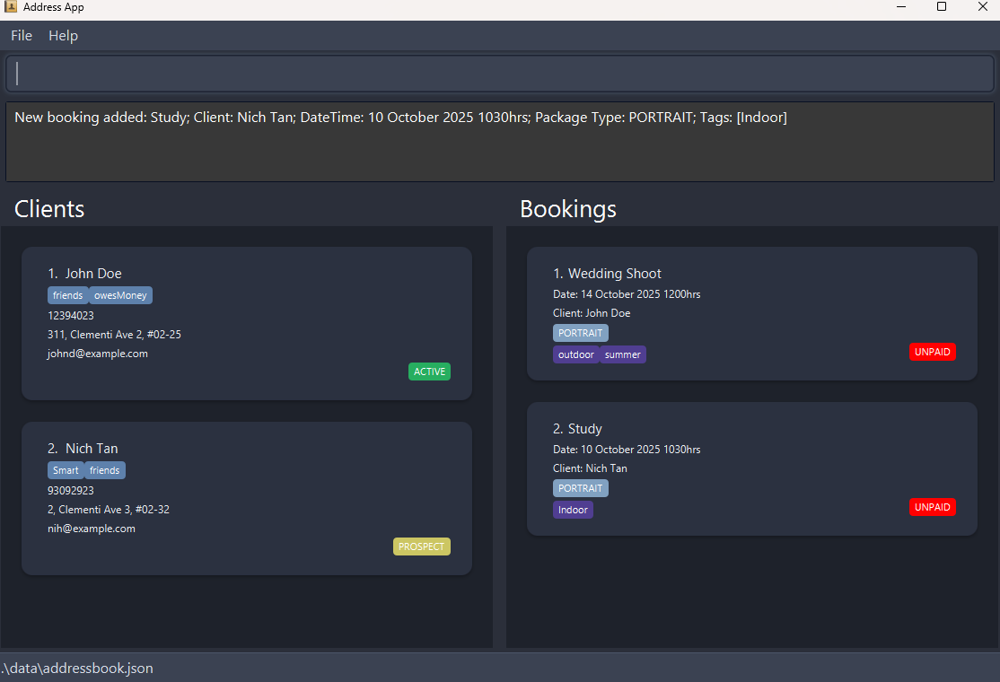
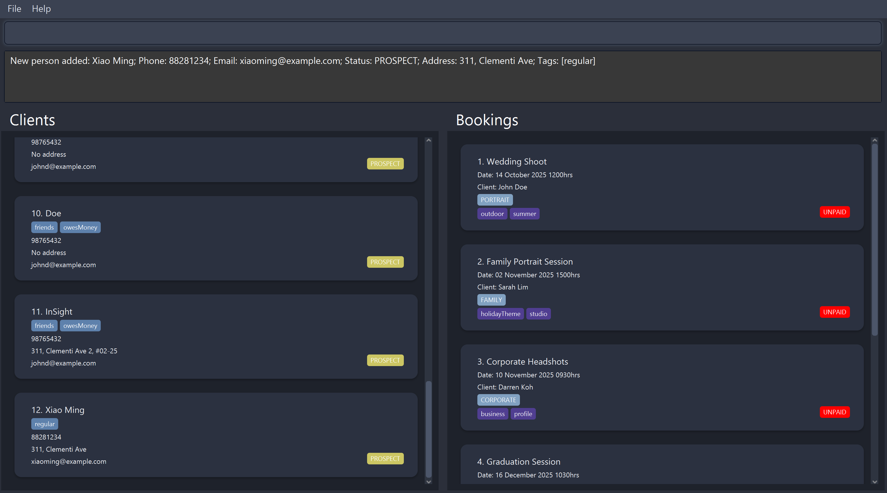
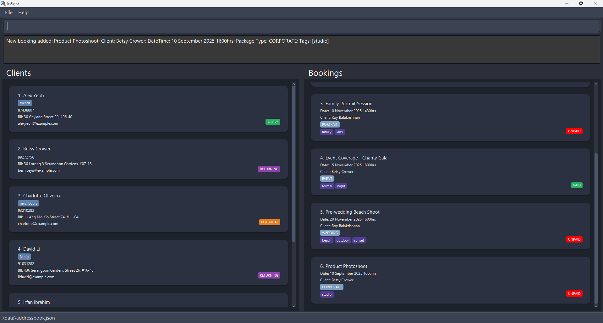
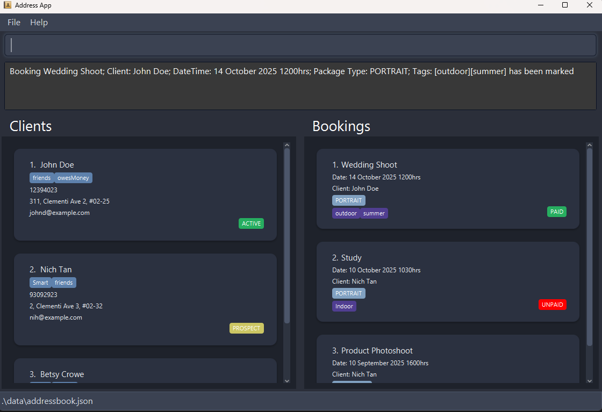
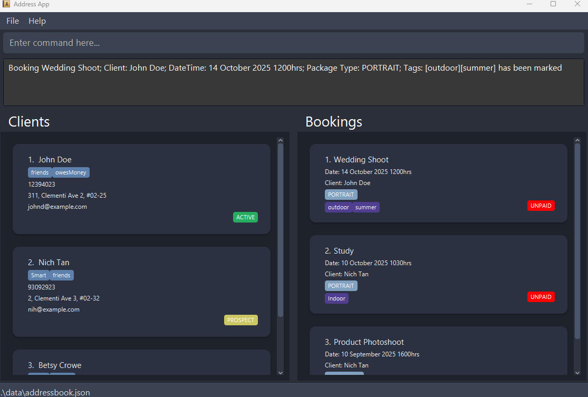
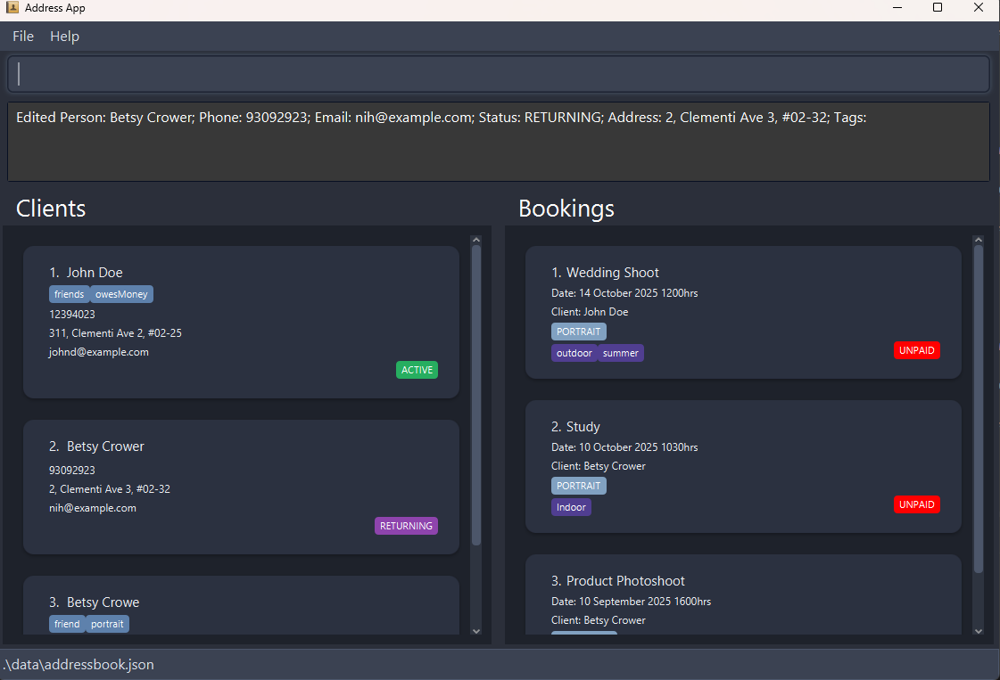
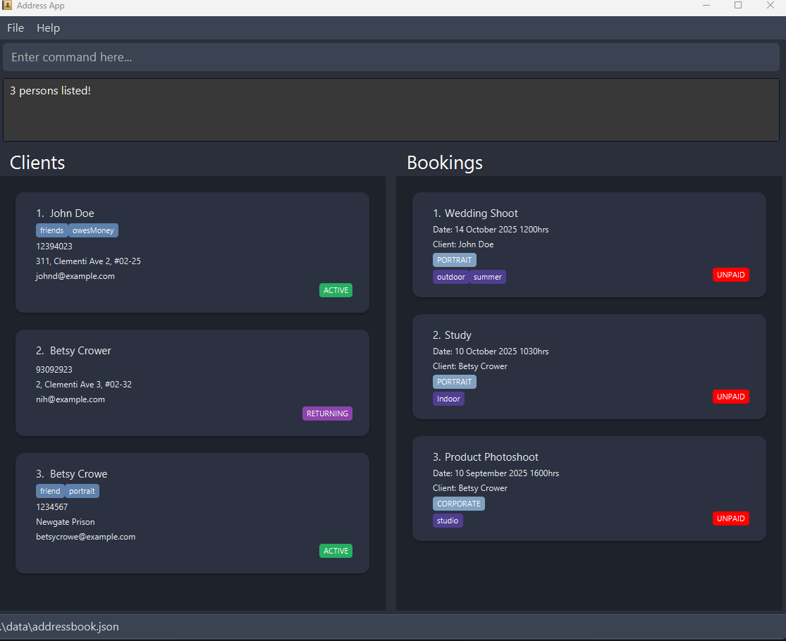
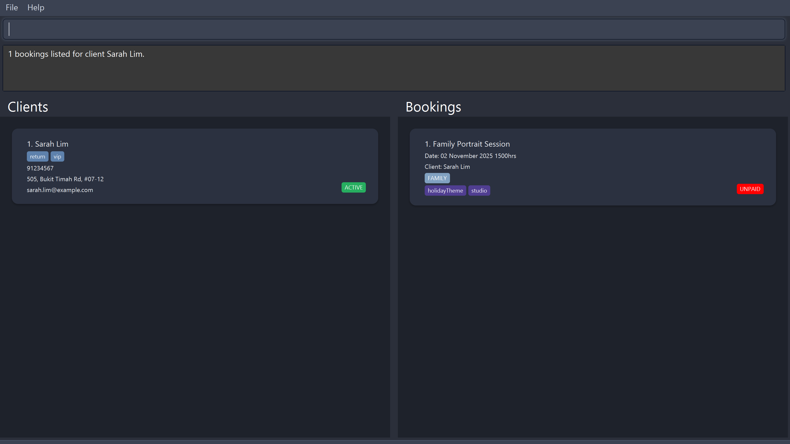
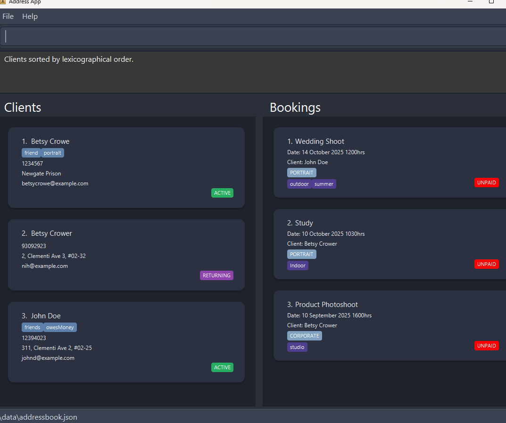
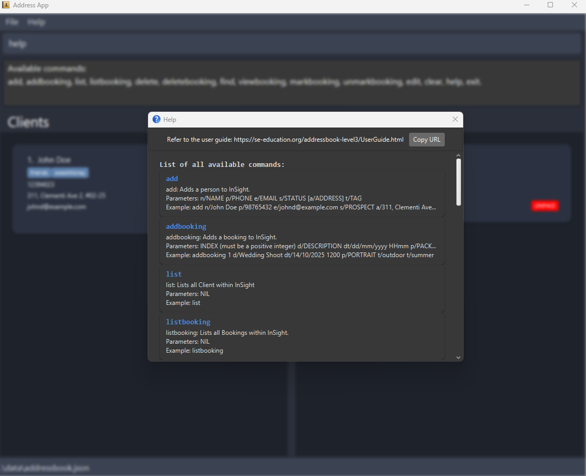

# InSight User Guide

> **Version:** 1.0  
> **Built for:** Creative professionals (photographers, videographers, and media freelancers)  
> **Based on:** SE-EDU AddressBook Level 3

---

## 📖 Table of Contents
1. [Quick Start](#-quick-start)
2. [Command Reference](#-command-reference)
3. [Features](#-features)
4. [Glossary](#-glossary)
5. [Saving the Data](#-saving-the-data)
6. [FAQ](#-faq)
7. [Known Issues](#-known-issues)

---

## ⚡ Quick-Start

1. Ensure **Java 17** or above is installed on your computer.
2. Download the latest `.jar` file from [InSight Releases](https://github.com/se-edu/addressbook-level3/releases).
3. Copy the file to your preferred folder.
4. Open a terminal and run:
   ```bash
   java -jar insight.jar
   ```
5. Use commands such as `help`, `list`, or `add` to begin.

> 💡 **Tip:** Refer to the [Features](#-features) section for detailed examples of each command.

---

## 💻 Command Reference

| Command         | Description                                                                                                                                                                                          |
|-----------------|------------------------------------------------------------------------------------------------------------------------------------------------------------------------------------------------------|
| `add`           | Adds a person to InSight. <br/> Parameters: `n/NAME p/PHONE e/EMAIL s/STATUS [a/ADDRESS] [t/TAG]` <br/> Example: `add n/John Doe p/98765432 e/johnd@example.com s/PROSPECT a/311, Clementi Ave`      |
| `addbooking`    | Adds a booking to InSight. <br/> Parameters: `INDEX d/DESCRIPTION dt/dd/mm/yyyy HHmm p/PACKAGE t/TAG` <br/> Example: `addbooking 1 d/Wedding Shoot dt/14/10/2025 1200 p/PORTRAIT t/outdoor t/summer` |
| `list`          | Lists all clients. <br/> Example: `list`                                                                                                                                                             |
| `listbooking`   | Lists all bookings. <br/> Lists all bookings within InSight. <br/> Example: `listbooking`                                                                                                            |
| `markbooking`   | Marks a booking as 'Paid'. <br/> Parameters: `INDEX` <br/> Example: `markbooking 1`                                                                                                                  |
| `unmarkbooking` | Unmarks a booking as 'Not Paid'. <br/> Parameters: `INDEX`   <br/> Example: `unmarkbooking 1`                                                                                                        |
| `edit`          | Edits client details. <br/> Parameters: `INDEX [n/NAME] [p/PHONE] [e/EMAIL] [s/STATUS] [a/ADDRESS] [t/TAG]` <br/> Example: `edit 1 p/91234567 e/johndoe@example.com`                                 |
| `editbooking`   | Edits booking details. <br/> Parameters: `INDEX [d/DESCRIPTION] [dt/DATETIME] [p/PACKAGE] [t/TAG]`  <br/> Example: `editbooking 1 d/Wedding Shoot p/WEDDING`                                         |
| `delete`        | Deletes a client. <br/> Parameters: `INDEX`  <br/> Example: `delete 1`                                                                                                                               |
| `deletebooking` | Deletes a booking. <br/> Parameters: `INDEX` <br/> Example: `deletebooking 1`                                                                                                                        |
| `find`          | Finds clients by name or status. <br/> Parameters: `name + [name1 name2…]` or `status + [status1 status2…].  <br/> Examples . `find name alice bob . `find status active returning`                  |
| `viewbooking`   | Displays all bookings for a specific client.<br/> Parameters: `INDEX` <br/> Example: `viewbooking 1`                                                                                                 |
| `sort`          | Sorts clients lexicographically.   <br/> Example: `sort`                                                                                                                                             |
| `sortbooking`   | Sorts bookings by date and time.   <br/> Example: `sortbooking`                                                                                                                                      |
| `clear`         | Clears all data from InSight. <br/> Example: `clear`                                                                                                                                                 |
| `help`          | Displays help information. <br/> Example: `help`                                                                                                                                                     |
| `exit`          | Exits InSight. <br/>  Example: `exit`                                                                                                                                                                |

---

## 🧭 Features
- Refer to the glossary for terms you are unsure of.  
- For the list of appropriate status fields, refer [here](#1-client-status).  
- For more information about the INDEX, refer [here](#5-indexing).  
- If you are unclear on the formatting of the date time field, refer [here](#4-date--time-format).  
- For the list of appropriate package types, refer [here](#2-package-types).  
- For more information about the tag, refer [here](#3-tag-keywords).

### Adding a person: add

Adds a person (client) to InSight.

**Format:**  
`add n/NAME p/PHONE e/EMAIL s/STATUS [a/ADDRESS] [t/TAG]…`

💡 **Tip:** A client can have any number of tags (including 0).

The status field (e.g., PROSPECT, ACTIVE, RETURNING) helps classify clients by engagement level.

**Examples:**  
`add n/John Doe p/98765432 e/johnd@example.com s/PROSPECT a/311, Clementi Ave t/wedding`  
`add n/Betsy Crowe t/friend e/betsycrowe@example.com s/ACTIVE a/Newgate Prison p/1234567 t/portrait`


### Adding a booking: addbooking

Adds a booking to a specific client in InSight.

**Format:**  
`addbooking INDEX d/DESCRIPTION dt/dd/mm/yyyy HHmm p/PACKAGE [t/TAG]…`

**Notes:**
- The INDEX refers to the client’s index in the displayed list.
- Each booking is tied to a client entry.
- Tags can represent the booking type, theme, or location.

**Examples:**  
`addbooking 1 d/Wedding Shoot dt/14/10/2025 1200 p/PORTRAIT t/outdoor t/summer`  
`addbooking 2 d/Product Photoshoot dt/10/09/2025 1600 p/CORPORATE t/studio`



### Listing all clients: list

Shows a list of all clients stored in InSight.

**Format:**  
`list`

**Example:**  
`list`

### Listing all bookings: listbooking

Displays all bookings stored in InSight.

**Format:**  
`listbooking`

**Example:**  
`listbooking`

### Marking a booking as paid: markbooking

Marks a booking as Paid.

**Format:**  
`markbooking INDEX`

**Notes:**  
The INDEX refers to the booking number displayed in the booking list. This helps users track completed or settled payments.

**Example:**  
`markbooking 1`


### Unmarking a booking as unpaid: unmarkbooking

Marks a booking as Not Paid.

**Format:**  
`unmarkbooking INDEX`

**Example:**  
`unmarkbooking 2`


### Editing a client: edit

Edits details of a client in InSight.

**Format:**  
`edit INDEX n/NAME p/PHONE e/EMAIL s/STATUS [a/ADDRESS] [t/TAG]…`

**Notes:**
- The INDEX refers to the client’s position in the displayed list.
- At least one optional field must be provided.
- Editing tags will overwrite previous tags.
- To remove all tags, type `t/` without specifying any tag.
- Editing address with a/<blank> will change the address to a "No address". 

**Examples:**  
`edit 1 p/91234567 e/johndoe@example.com`  
`edit 2 n/Betsy Crower s/RETURNING t/`


### Editing a booking: editbooking

Edits details of an existing booking.

**Format:**  
`editbooking INDEX d/DESCRIPTION dt/DATETIME p/PACKAGE [t/TAG]…`

**Notes:**
- The INDEX refers to the booking index in the booking list.
- You can update multiple fields at once.
- To clear all tags, type `t/` without specifying any.

**Examples:**  
`editbooking 1 d/Wedding Shoot p/WEDDING`  
`editbooking 2 dt/21/09/2025 1600 t/sunset`

### Deleting a client: delete

Deletes a client from the InSight database.

**Format:**  
`delete INDEX`

**Notes:**
- Deletes the client at the specified index from the client list.
- All related bookings remain in the system unless deleted manually.

**Examples:**  
`list` followed by `delete 2` deletes the second client in the list.  
`find Betsy` followed by `delete 1` deletes the first client in the search results.

### Deleting a booking: deletebooking

Deletes a booking record from InSight.

**Format:**  
`deletebooking INDEX`

**Example:**  
`deletebooking 1`

### Finding clients: find

Finds clients whose names or statuses match the given keywords.

**Format:**  
`find name KEYWORD [MORE_KEYWORDS]`  
or  
`find status STATUS [MORE_STATUSES]`

**Notes:**
- Search is case-insensitive.
- The order of keywords does not matter.
- Returns any client matching one or more keywords (OR search).

**Examples:**  
`find name alice bob charlie`  
`find status active returning`


### Viewing all bookings for a client: viewbooking

Displays all bookings associated with a selected client.

**Format:**  
`viewbooking INDEX`

**Notes:**  
The INDEX refers to the client’s index. Use this command to view all bookings tied to a specific person.

**Example:**  
`viewbooking 1`


### Sorting clients: sort

Sorts clients alphabetically by name.

**Format:**  
`sort`

**Example:**  
`sort`


### Sorting bookings: sortbooking

Sorts all bookings by date and time.

**Format:**  
`sortbooking`

**Example:**  
`sortbooking`

### Clearing all data: clear

Clears all clients and bookings from InSight.

**Format:**  
`clear`

**Example:**  
`clear`

### Viewing help: help

Shows usage instructions and available commands.

**Format:**  
`help`

**Example:**  
`help`


### Exiting the program: exit

Closes the InSight application.

**Format:**  
`exit`

**Example:**  
`exit`

---

## 📚 Glossary

### 1. Client Status


| Status    | Meaning                                                                        | Typical Use Case                                       |
|-----------|--------------------------------------------------------------------------------|--------------------------------------------------------|
| PROSPECT  | A potential client who has expressed interest but not confirmed a booking yet. | New lead from social media, email, or inquiry form.    |
| ACTIVE    | A current client with one or more ongoing or upcoming bookings.                | Client with a confirmed event or ongoing project.      |
| RETURNING | A past client who has returned for additional services.                        | Repeat customer booking a new shoot or event.          |
| COMPLETED | A client whose project(s) have been completed and delivered.                   | Finished work, awaiting feedback or testimonial.       |
| INACTIVE  | A client who has not engaged for a long period or has opted out.               | Dormant contacts for archiving or marketing reference. |

### 2. Package Types

| Package Type | Description                                                                         | Example Use Case                                |
|--------------|-------------------------------------------------------------------------------------|-------------------------------------------------|
| WEDDING      | Full wedding photography or videography coverage, often spanning multiple sessions. | `editbooking 1 p/WEDDING`                       |
| PORTRAIT     | Individual, couple, or family portraits conducted in studio or outdoor settings.    | `addbooking 1 d/Graduation Shoot p/PORTRAIT`    |
| COMMERCIAL   | Product, branding, or corporate-related shoots.                                     | `addbooking 2 d/Product Launch p/COMMERCIAL`    |
| EVENT        | Coverage of public/private events (birthdays, conferences).                         | `addbooking 3 d/Company Dinner p/EVENT`         |
| LIFESTYLE    | Candid or aesthetic sessions capturing daily activities.                            | `addbooking 1 d/Instagram Campaign p/LIFESTYLE` |
| MATERNITY    | Shoots for expecting mothers/families.                                              | `addbooking 2 d/Maternity Portrait p/MATERNITY` |
| TRAVEL       | Destination shoots involving travel logistics.                                      | `addbooking 1 d/Pre-Wedding in Bali p/TRAVEL`   |
| CUSTOM       | Flexible or hybrid requests not fitting standard categories.                        | `addbooking 2 d/Studio & Drone Shoot p/CUSTOM`  |


### 3. Tag Keywords

| Tag       | Meaning                      | Example       |
|-----------|------------------------------|---------------|
| outdoor   | Shoot conducted outdoors     | `t/outdoor`   |
| studio    | Conducted in indoor settings | `t/studio`    |
| priority  | VIP or urgent booking        | `t/priority`  |
| editing   | Workflow in post-production  | `t/editing`   |
| delivered | Work delivered to client     | `t/delivered` |

### 4. Date & Time Format

All bookings use the datetime format:  
`dt/dd/mm/yyyy HHmm`

**Example:**  
`dt/14/10/2025 1200` → October 14, 2025, at 12:00 PM.

### 5. Indexing

The INDEX parameter refers to the numeric position of an entry (client or booking) in the currently displayed list.

**Example:**  
`edit 1` edits the first client.  
`editbooking 2` edits the second booking shown in the list.

---

## 💾 Saving the Data

InSight automatically saves all changes to disk after each command. No manual saving is required.


---

## ❔ FAQ

**Q:** How do I transfer data to another computer?  
**A:** Copy the data file from the source folder into the target folder and restart InSight.
> 💡 **Tip:** To migrate data, copy the `.json` file from your home directory to another device.

---

## ⚠️ Known Issues

- Moving the GUI to another monitor may cause positioning errors on reopen.
- If the Help Window is minimized, running `help` again will not reopen it automatically.

---

> © 2025 InSight Team. Built upon SE-EDU AddressBook Level 3.
